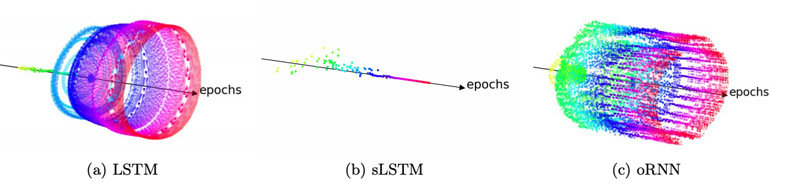

# Analysing recurrent neural network training

Companion code to the 2020 AISTATS paper: 
''Beyond exploding and vanishing gradients: analysing RNN training using attractors and smoothness"
https://arxiv.org/pdf/1906.08482.pdf.

```
@inproceedings{ribeiro_beyond_2020,
author = {Ribeiro, Ant\^{o}nio H. and Tiels, Koen and Aguirre,
Luis A. and Sch\"on, Thomas B. },
title = {Beyond exploding and vanishing gradients: analysing
RNN training using attractors and smoothness},
year = {2020},
booktitle = {Proceedings of the 23rd International Conference
on Artificial Intelligence and Statistics (AISTATS).},
publisher = {PMLR},
volume = {108}
}
```


## Download and Usage


To load this repository run:
```bash
git clone git@github.com:antonior92/attractors-and-smoothness-RNN.git
# or, alternatively: git clone https://github.com/antonior92/attractors-and-smoothness-RNN.git
```

### Submodules

This package have [expRNN](https://github.com/Lezcano/expRNN) as a submodule. To
load this submodule run (from inside the repository):
```bash
git submodule init
git submodule update
```
or, alternatively, add the option ``--recurse-submodules`` in git clone.

### Dependencies

This package was tested in Python 3.6 and for PyTorch 1.1. Other dependencies include 
numpy, scipy, matplotlib and tqdm. Check ``requirements.txt``.

### Required datasets

We use the "wikitext-2" dataset in the word-level language model example (a full description of the dataset is available
[here](https://www.salesforce.com/products/einstein/ai-research/the-wikitext-dependency-language-modeling-dataset/)).

The dataset is small and we save it inside this git repository (`word-language-model/wikitext-2/`).


## Repository structure

This repository contain a folder for each of the experiments described in the paper. 
Each folder contain scripts for training and analysing RNNs in the tasks of:
- ``sine-generator``:  modeling sine-waves with varying frequencies;
- ``word-language-model``: obtaining a word-level language model from wikitext-2 dataset;
- ``sequence-classification``: classification of sequences according to a few relevant symbols.


## Model training

To train the model run:
```bash
cd sine-generator  # or "word-language-model" or "sequence-classification"
python train.py
```
there is the option ``--cuda`` which should enable the use of the GPU. The script will
should create a folder ``output-YYYY-MM-DD HH:MM:SS.MMMMMM`` (with the date and time the script
was called) inside the current directory and save information inside it. Alternatively,
it is possible to pass an option ``--folder [FOLDERNAME]`` which specifies the name of the folder.
To see all options check options run:
```bash
python train.py --help
```
which should print all possible command line options. Which include different architecture configuration
and training specifications. One important option is ``--interval_orbit N``, which save points
every ``N``-th epoch, which latter can be used for generating the biffurcation diagrams (a.k.a. orbit diagram)
such as the one bellow:



#### Training output
The folder created during training will have the structure:
```
FOLDERNAME/
    history.csv
    model.pth
    train.pyconfig.json
    (orbit_per_epoch_diagram.pth)
```
where ``history.csv`` is a column separated text file containing: training and validation loss; learning rate and
other metrics, for the model during the training procedure (per epoch). ``model.pth`` is a binary file containing
the weights of the model that was obtained. ``train.pyconfig.json`` is a json file containing the configuration
(i.e., the options passed from the command line) that were used to obtain such model. Finally,
``orbit_per_epoch_diagram.pth`` is a file that will be create only if the option ``--interval_orbit N``
is passed during train. This binary file contains points saved during training every ``N``-th epoch, these points
can be used for generating the biffurcation diagram (a.k.a. orbit diagram).

